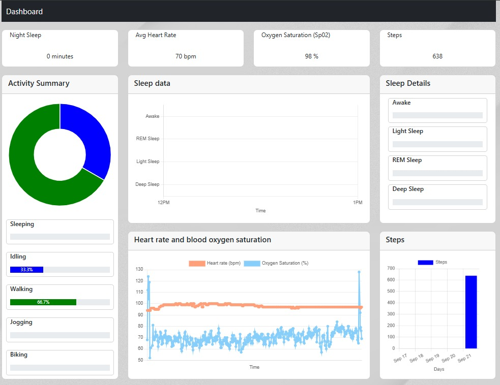

# Nano-RP2040 Fitness Tracker

## Overview
This project uses a Nano RP2040 board connected to an external heart rate monitor to track various fitness and health activities.
The Nano RP2040 board has a Raspberry Pi RP2040 microcontroller and an inbuilt 6-axis Inertia Measurement Unit (IMU) with a dedicated
machine learning core that will help us detect activities such as walking and jogging.
The data is transmitted via MQTT to an IoT server built with a Node.js backend, stored in an InfluxDB database, and visualized on a React dashboard. You can find the complete project on [this](https://github.com/Kneatrum/iot-server) repository.
## Components 
* Nano-RP2040 microcontroller
* MAX30100 heart rate and SpO2 sensor
* Breadboard and jumper wires
* USB cable for programming and power
* Mosquitto MQTT broker

## Hardware setup
1. Connect the MAX30100 sensor to the Nano-RP2040:
   * VCC to 3.3V
   * GND to GND
   * SDA to GPIO12 (I2C SDA)
   * SCL to GPIO13 (I2C SCL)
2. The LSM6DSO IMU is already connected to the rp2040 microcontroller on the PCB.
